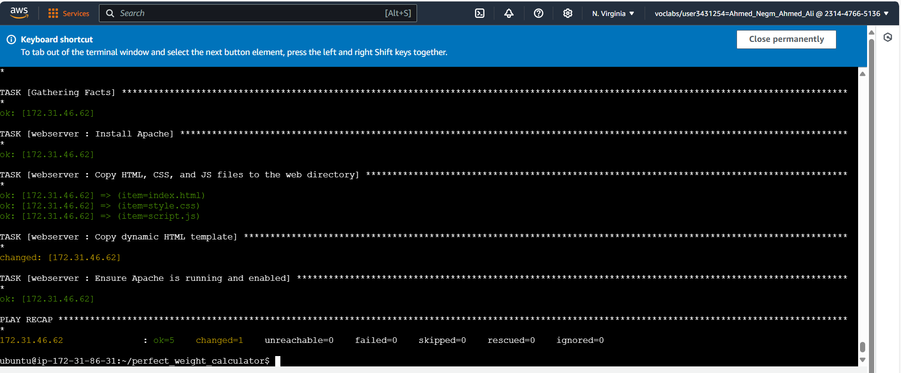

# Perfect Weight Calculator

## Project Description
The Perfect Weight Calculator is a web application that assists users in calculating their ideal weight based on several factors, such as height, age, and gender. This application aims to provide an easy-to-use tool for individuals looking to maintain a healthy weight.

## Key Features:
- User-friendly and simple interface.
- Ability to input personal information (height, weight, gender, age).
- Calculation of ideal weight based on recognized mathematical formulas.
- Clear and understandable presentation of results.

## Technologies Used:
- **HTML**: To create the basic structure of the pages.
- **CSS**: For styling and designing the user interface.
- **JavaScript**: To perform dynamic calculations and provide user interactivity.
- **Ansible**: To automate the deployment process and distribute the application on the server.

## Concepts Used in Ansible:
- **Roles**: To organize different configuration files, such as installing the web server, copying files, and setting up the environment.
- **Templates**: To use dynamic HTML templates, such as `index.html.j2`, which are utilized to generate pages based on variables.
- **Modules**: To use Ansible modules like `copy` and `template` for transferring files and applying templates.
- **Variables**: To store information such as the site title and pass it to the templates.

## Project Images

